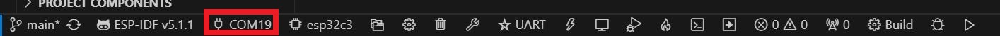
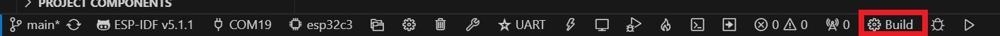
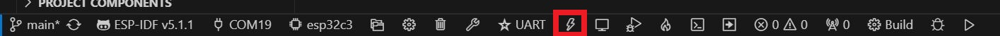

# HealthyPi 5 ESP-IDF Firmware for ESP32C3 HCI coprocessor


Follow the below steps to program the ESP32-C3 of Healthypi 5:

1. Install the VSCode Extension for ESP-IDF using the [Official Espressif guide here](https://docs.espressif.com/projects/esp-idf/en/stable/esp32/get-started/index.html).

2. Clone the repository.
    ```
    git clone https://github.com/Protocentral/healthypi5_esp32c3_hci_h4.git
    ```

3. Open the cloned repository in VSCode.

4. Connect one end of the USB Cable to the USB port of ESP32 present on the Healthypi 5 board and other end to the computer/laptop.

5. At the bottom of VSCode Editor, ensure the ESP-IDF is connected to the ESP32 port of Healthypi 5.
    
    
    

6. Click on the Build option present on the bottom of the IDE.

    

7. Click on Flash option present on the bottom of the IDE.
    
    


You have now successfully programmed the ESP32-C3 of Healthypi 5!!!

